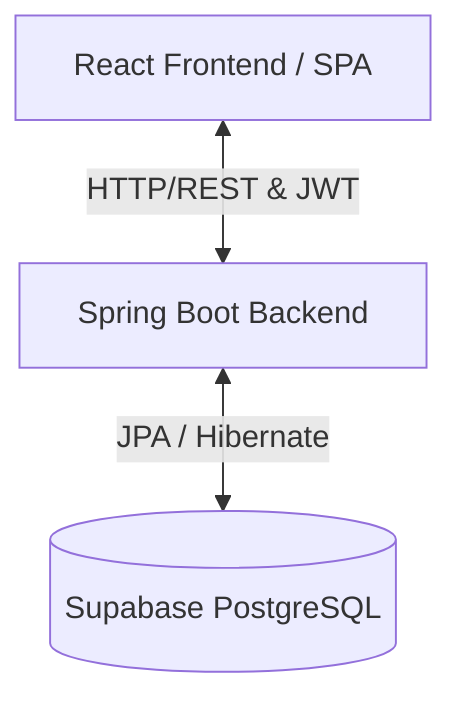
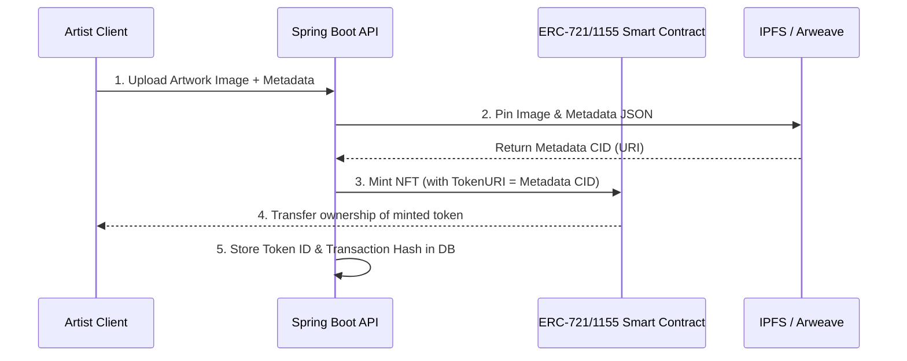

# ARTORA Project Documentation

Welcome to **ARTORA**, a premium web platform for artists, collectors, and art curators. ARTORA bridges the gap between traditional fine art galleries and digital accessibility, allowing artists to exhibit their work, collectors to purchase masterpieces, and admins to curate collections.

---

## 🏗️ Architecture Overview

The application follows a decoupled client-server architecture:

### 1. Frontend (React Single Page Application)
- **Build Tool & Bundler**: [Vite](file:///d:/ARTORA/ARTORA/vite.config.js)
- **Core Technologies**: React 19, React Router DOM v7 (for client-side routing)
- **Styling & Motion**: TailwindCSS, CSS Variables, and [Framer Motion](https://www.framer.com/motion/) for premium, fluid animations.
- **3D Interactive elements**: `@react-three/fiber` & `three.js` (e.g., [SphereBackground.jsx](file:///d:/ARTORA/ARTORA/src/components/background/SphereBackground.jsx))
- **Scroller**: `lenis` for smooth inertial scrolling on desktops.

### 2. Backend (Spring Boot REST API)
- **Language**: Java 21
- **Framework**: Spring Boot 3.5.x
- **Security**: Spring Security + Stateless JWT Authentication ([SecurityConfig.java](file:///d:/ARTORA/ARTORA/backend/src/main/java/com/artora/artora_backend/security/SecurityConfig.java))
- **Persistence**: Spring Data JPA with PostgreSQL ([application.properties](file:///d:/ARTORA/ARTORA/backend/src/main/resources/application.properties))

---

## 🗃️ Database Domain Models & Entities

The relational database layer consists of 5 main entities:

1. **[User](file:///d:/ARTORA/ARTORA/backend/src/main/java/com/artora/artora_backend/entity/User.java)**:
   - Represents platform users.
   - Implements Spring Security's `UserDetails`.
   - Has a [Role](file:///d:/ARTORA/ARTORA/backend/src/main/java/com/artora/artora_backend/entity/Role.java) (enum: `ADMIN`, `ARTIST`, `BUYER`).
   - One-to-one relationship with `Artist` (if role is `ARTIST`).

2. **[Artist](file:///d:/ARTORA/ARTORA/backend/src/main/java/com/artora/artora_backend/entity/Artist.java)**:
   - Stores professional biography, nationality, birth year, and profile images.
   - Connected back to the user account.

3. **[Artwork](file:///d:/ARTORA/ARTORA/backend/src/main/java/com/artora/artora_backend/entity/Artwork.java)**:
   - Holds listing details: title, description, price, category, medium, creation year, image URL, and availability status.
   - Linked to an `Artist` via a many-to-one relationship.

4. **[Collection](file:///d:/ARTORA/ARTORA/backend/src/main/java/com/artora/artora_backend/entity/Collection.java)**:
   - Curated groups of artworks.
   - Many-to-many relationship with `Artwork` (mapped via table `collection_artworks`).

---

## 🔌 API Gateway & Integration

All communication between the React client and Spring Boot is brokered by [api.js](file:///d:/ARTORA/ARTORA/src/data/api.js).
- **Graceful Fallbacks**: If the backend server is unreachable or offline, the API client automatically catches errors and returns mock data from [mock.js](file:///d:/ARTORA/ARTORA/src/data/mock.js), enabling local design iteration without a running database.
- **Interceptors & Headers**: JWT tokens are automatically retrieved from `localStorage` and injected into HTTP requests as `Authorization: Bearer <token>`.

---

## 🔮 Roadmap: NFT Integration for Decentralized Record Storing

To ensure immutable provenance, verify ownership, and build a truly trustless art marketplace, ARTORA is scheduled to transition to **decentralized record storing using Non-Fungible Tokens (NFTs)**.

### How the NFT Provenance Flow Will Work:

### Key Integration Points:
1. **Decentralized Storage (IPFS / Pinata / Web3.Storage)**:
   - When an artwork is listed, the image file and its detailed descriptive JSON (provenance history, title, medium, artist name) will be pinned to a decentralized storage network (like IPFS or Arweave). This yields an immutable content identifier (CID) serving as the metadata link.
2. **Smart Contracts (ERC-721 / ERC-1155)**:
   - Deploying an artwork registry smart contract on an EVM-compatible chain (e.g., Ethereum, Polygon, or Arbitrum).
   - Every physical/digital artwork on ARTORA gets minted as a unique NFT.
3. **Web3 Client Integration (Viem / Ethers.js / Wagmi)**:
   - Integrate crypto wallets (like MetaMask or WalletConnect) on the frontend.
   - Allow users to pay in cryptocurrency (e.g., ETH, USDC) and trigger on-chain transfers of ownership upon purchase.
4. **On-chain Provenance Log**:
   - The NFT transaction history (mints, transfers, listings) will act as the canonical, decentralized certificate of authenticity, removing the need to trust a centralized database.
