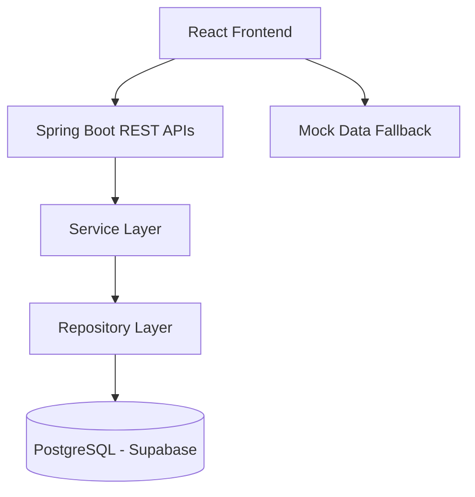

## GALERO

> A full-stack digital artwork marketplace built using **React, Spring Boot, and PostgreSQL**, designed to help artists showcase, manage, and explore digital artworks through a modern and scalable web application.

**Status:** Under Active Development
**Future Scope:** NFT-based artwork provenance and decentralized record storage.

---

## Overview

ARTORA is a full-stack application that bridges art and technology by providing a platform for artists and collectors to manage digital artworks. The project focuses on clean architecture, RESTful API development, and cloud deployment while maintaining an extensible design for future Web3 integration.

---

## Features

* User Registration and Authentication
* Artist and User Profiles
* Artwork Management (Create, Read, Update, Delete)
* Artwork Listings and Detail Pages
* Collections Management
* Responsive and Interactive User Interface
* Smooth Animations and 3D Visual Elements
* Mock Data Fallback when Backend Services are Unavailable
* Cloud-hosted PostgreSQL Database

---

## Technology Stack

| Layer             | Technologies                 |
| ----------------- | ---------------------------- |
| Frontend          | React 19, Vite, Tailwind CSS |
| Animations        | Framer Motion, Lenis         |
| 3D Graphics       | Three.js, React Three Fiber  |
| Backend           | Java 21, Spring Boot 3.5.x   |
| Security          | Spring Security, JWT         |
| Database          | PostgreSQL (Supabase)        |
| ORM               | Spring Data JPA, Hibernate   |
| API Communication | Native Fetch API             |
| Deployment        | Vercel, Supabase             |

---

## Architecture



---

## Project Structure

```text
ARTORA
│
├── backend
│   └── src/main/java/com/artora/artora_backend
│       ├── entity
│       ├── controller
│       ├── repository
│       ├── service
│       └── security
│
└── src
    ├── components
    │   ├── layout
    │   └── background
    ├── context
    ├── data
    ├── pages
    └── App.jsx
```

---

## Backend Modules

### Entities

* User
* Artist
* Artwork
* Collection
* Role (ADMIN, ARTIST, BUYER)

### Controllers

* AuthController
* UserController
* ArtistController
* ArtworkController
* FileUploadController

### Security

* SecurityConfig
* JwtAuthenticationFilter
* JwtUtil
* CustomUserDetailsService

---

## Local Setup

### Database

Deployed at:

```text
https://vfewoocjynrbgyrhlqwo.supabase.co
```

### Backend

```bash
cd backend
mvn spring-boot:run
```

Runs on:

```text
http://localhost:8080
```

### Frontend

```bash
npm install
npm run dev
```

Runs on:

```text
https://artora-mu.vercel.app
```

---

## Development Flow

```text
React Frontend
      ↓
Fetch API
      ↓
Spring Boot REST APIs
      ↓
Service Layer
      ↓
Repository Layer
      ↓
PostgreSQL (Supabase)
```

---

## Web3 / NFT Roadmap

ARTORA is designed with future support for decentralized artwork ownership and provenance.

Planned integrations include:

* IPFS or Arweave for decentralized metadata and image storage
* ERC-721 / ERC-1155 smart contracts
* MetaMask and WalletConnect integration
* Deployment on Polygon or Arbitrum
* On-chain ownership history and provenance tracking

**Proposed Flow**

```text
Artwork
   ↓
IPFS / Arweave
   ↓
Smart Contract
   ↓
NFT Minting
   ↓
Wallet Ownership
   ↓
On-Chain Provenance
```

---

## Cost-Free Development Strategy

| Service          | Usage                       |
| ---------------- | --------------------------- |
| Vercel           | Frontend Hosting            |
| Supabase         | PostgreSQL Database Hosting |
| Native Fetch API | API Communication           |
| Local Storage    | Media Upload Handling       |
| GitHub           | Version Control             |

The project is currently developed and tested using only free-tier services, enabling a complete full-stack development workflow with zero infrastructure cost.

---

## Concepts Demonstrated

* Full-Stack Development
* RESTful API Design
* Layered Architecture
* Spring Security and JWT Authentication
* Database Modeling and Relationships
* JPA and Hibernate ORM
* Cloud Deployment
* Responsive UI Development
* Scalable System Design

---

## Author

**Shreyas Upadhye**
B.Tech Computer Science & Engineering (AI & Edge Computing)
MIT ADT University

**Areas of Interest:** Java Backend Development, Full-Stack Engineering, System Design, Blockchain Applications, AI and Edge Computing.
